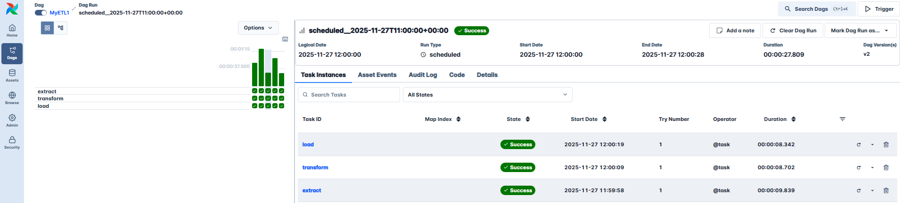

# Extract Transform Load pipeline with Airflow and Google Bigquery

**Project Summary:**
Hands-on Apache Airflow 3.1+ ETL pipeline that fetches live weather data, transforms it, and loads it into Google Cloud. Fully containerized with Docker, uses CeleryExecutor + Redis for scalable task orchestration, and demonstrates a realistic Airflow pipeline.

[](https://www.python.org/)
[](https://airflow.apache.org/)
[](https://www.docker.com/)
[](https://www.postgresql.org/)
[](https://redis.io/)
[](https://console.cloud.google.com/bigquery)

---

## What I Learned / Key Takeaways

- Designing and implementing **Airflow DAGs**
- Using **CeleryExecutor + Redis** for scalable task orchestration
- Managing **PostgreSQL connections** and safe data inserts with Python
- Handling **XComs properly**, avoiding serialization issues
- Containerized development with **Docker Compose** for Airflow services
- Debugging DAGs and tasks

---

## Architecture

This setup mirrors **production-like deployments (2025 standards):**

| Component        | Technology / Version            | Notes |
|-----------------|---------------------------------|-------|
| Executor        | CeleryExecutor                  | Scalable, battle-tested |
| Task Queue      | Redis                           | Fast, in-memory broker |
| Metadata DB     | PostgreSQL 16                   | Dedicated volume, isolated |
| Web UI / API    | Airflow FastAPI apiserver (8080)| Modern, responsive |
| Storage         | Google Bigquery                 | Scalable, modern |

---

## Features

- Fully containerized with **official Apache Airflow 3.1+ Docker images**
- Uses **CeleryExecutor + Redis** for real-world task orchestration
- Isolated PostgreSQL volume – safe to run alongside other Airflow instances
- Modern Airflow UI with FastAPI apiserver
- Ready to run with any public API – just drop DAGs into `dags/`
- **Zero extra Python dependencies** beyond the official Airflow image
- Example ETL DAG included: fetches live weather data and stores it in Bigquery

---

## Quickstart (Docker – Windows/macOS/Linux)

```bash


# 1. Clone the repository
git clone https://github.com/dominik-mikulski/ETL-Airflow-GCP.git
cd ETL-Airflow-GCP

# 2. Obtain open weather API key 
Open https://openweathermap.org/, setup account, copy API key. You will need it later on.

# 3. Setup GCP service account & key, setup permissions.
- Setup account at google cloud console and setup project (copy project id) 
- Create a service account at IAM & Admin -> Service Accounts and add permission to bigquery admin 
- Generate service account key and download key json (caution: never upload or share key anywhere its your private pass to bigquery)
- Enable BigQuery API in API & Services
- Using Cloud Services may generate costs, to avoid surprise set up billling account, link it with your project and set tresholds low to get email warning. 

# 3. Create the .env file with correct user ID
# Windows PowerShell:
'AIRFLOW_UID=50000' | Set-Content -Path .env -Encoding UTF8NoBOM

# macOS / Linux / WSL:
echo "AIRFLOW_UID=$(id -u)" > .env

# 4. Initialize Airflow DB (first time only)
docker compose up airflow-init

# 5. Start Airflow services in background
docker compose up -d

# 6. Access the UIs
Airflow:   http://localhost:8085   (login: airflow / airflow)
Adminer:   http://localhost:8090   (System: PostgreSQL, Server: postgres:5435, login: airflow / airflow)

# Setup connections & keys in Airlow UI
- Setup connection in Airlow UI with your api key -> Admin -> Connections. Conn_id=openweather, Type: HTTP, Host: api.openweathermap.org, Extra: {"api key": "your key from openweather"}
- Setup variable in Airflow UI with your project id -> Admin -> Variables. Key: gcp_project, Value: your GCP project id from GCP console

# 7. Stop everything and clean up
docker compose down -v
```

---

## Project Structure

```
├── dags/            ← Put your DAGs here
├── data/            ← Example output directory (gitignored)
|── keys/            ← Put your bigquery key here (*.json gitignored)
├── logs/            ← Airflow logs (gitignored)
├── docker-compose.yaml
└── README.md
```

## Future Improvements
- Add **logging** and better **error handling**
- Include **unit and integration tests**
- Implement **graceful task failure recovery**
- Enhance **security and network separation**
- Currently **not production-ready**; this is a showcase and learning project.


Picture Links:



